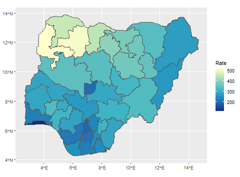
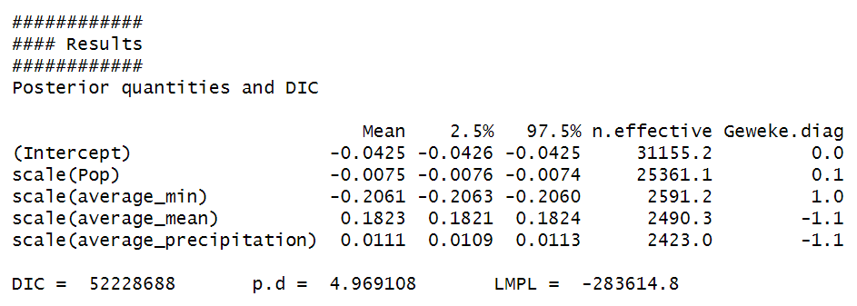
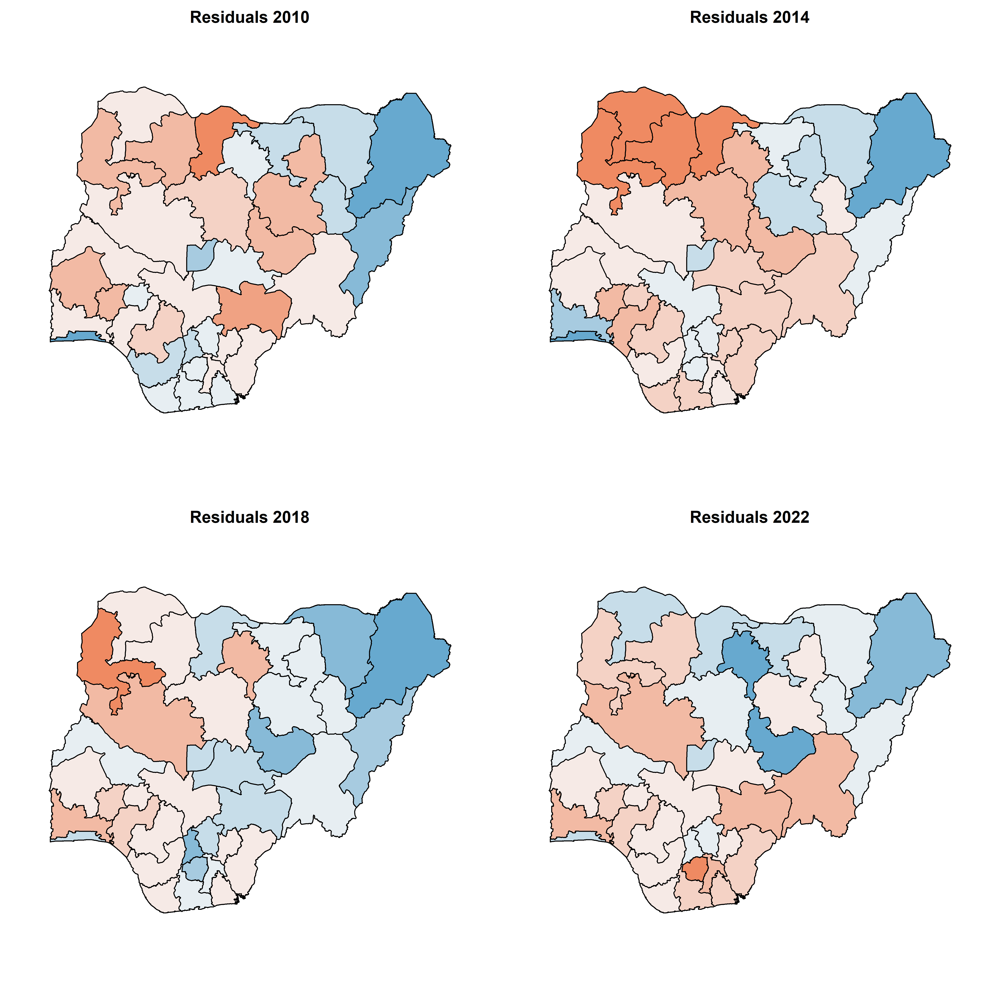
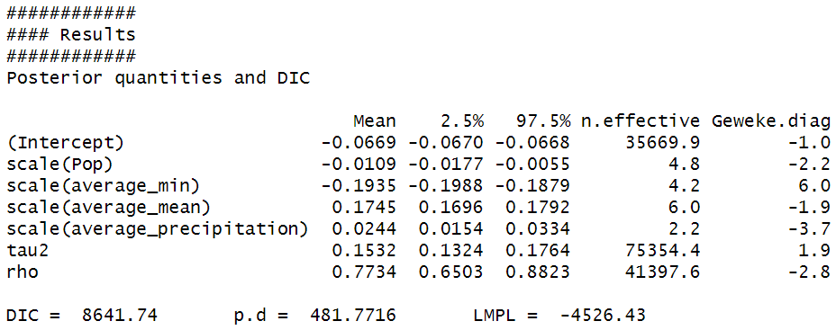
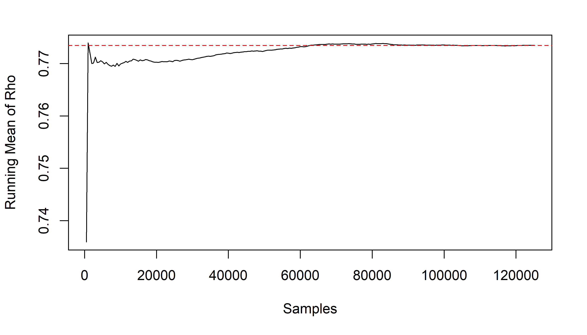
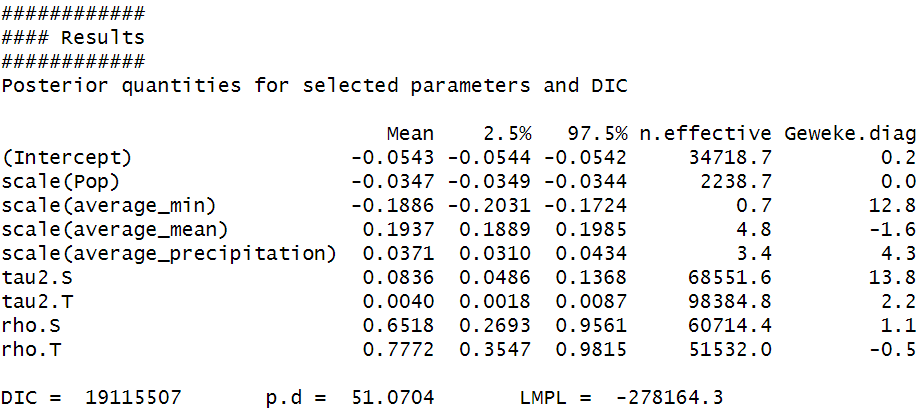
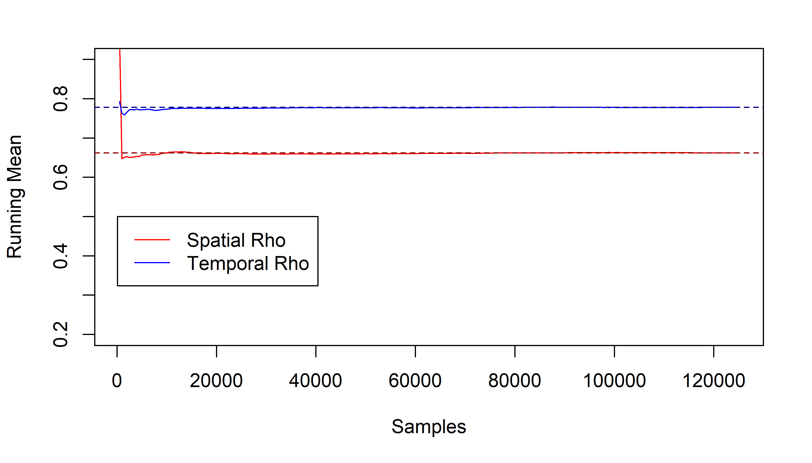

### Introduction

Malaria is a life-threatening, non-contagious disease that represents one of the most significant global health risks. According to UNICEF, in 2022, there were 249 million malaria cases globally that led to 608,000 deaths in total; many of these cases involved children under 5, and are considered preventable and treatable^[data.unicef.org]. The World Health Organization's 2023 global malaria report notes that malaria risk is most prevalent in tropical regions, and in particular sub-Saharan Africa; they also note that there was an overall decrease in malaria rates from 2000 to 2014, though rates have increased since 2015. In particular, disruption of malaria treatment and prevention resources due to the COVID-19 pandemic contributed to a spike in cases which has largely stabilized, though the number of global malaria deaths in 2022 was still larger than that of 2019^[WHO Global Malaria Report, 2023]. Among all countries, Nigeria bears the most significant impact from malaria, accounting for 26.8% of global cases and 31.1% of global deaths in 2022^[WHO Global Malaria Report, 2023]. Despite significant progress in the past few decades towards treatment and prevention, progress is still falling far short of the necessary milestones to reach the WHO's goal of 90% reduction in incidence rate and mortality by 2030^[WHO Global Malaria Report, 2023]. Therefore, understanding the variation in malaria infection over space and time is of interest in an epidemiological and socio-economic context, and provides an interesting case study for the application of spatio-temporal statistical disease mapping models. 

Because of the prevalence of malaria, there is a considerable interest in mapping and modeling its distribution throughout Africa and indeed tropical regions throughout the world. This has resulted in the application of a variety of methods to determine the structure, distribution, and evolution of malaria infection over space and time. One recent example comes from the work of Ogunsakin et al. (2024), whose study utilized point-measured malaria prevalence data and a suite of environmental indicators to examine the spatial patterns and temporal variability of malaria prevalence in Nigeria. Their results identified spatial variation in the density of malaria prevalence over time, along with indicating the importance of climate variables as covariates in the disease model. Similarly, Alegena et al. (2013) used Bayesian CAR models to conduct a spatio-temporal analysis of malaria incidence in Namibia, again with environmental variables as covariates. They also observed statistically significant temperature and precipitation covariates, as well as significant Bayesian model parameters for seasonal random effects. 

  Hierarchical spatial and spatio-temporal models for modeling disease incidence have seen a wide variety of applications over the years, and many different model variations and frameworks have been described in the literature. A central concern when studying and modeling disease data with both a spatial and temporal dimension is the issue of autocorrelation; locations (in our case, states) which are closer together are likely to have similar observed values than those farther apart, and measurements in consecutive years are likely to be more similar than those separated by several years^[Lee, Rushworth, Napier, 2018]. Therefore, an ideal model would be one which allows us to model disease incidence with covariates while also "borrowing strength" from local neighbors to improve the quality of the estimates^[Bivand, Pebesma, Gomez-Rubio, Applied Spatial Analysis with R]. Beginning with Besag (1991), a Bayesian approach has become the standard for statistical disease modeling, with the hierarchical structure allowing us to assign Conditional Autoregressive (CAR) priors to the spatial and temporal random effects to capture any spatio-temporal autocorrelation^[Handbook of Spatial Statistics, ch.14]. Estimates of the parameters in such models are commonly obtained by means of MCMC simulation techniques. 
  
  For this analysis, we will be focusing on data from the Malaria Atlas Project, an international research collaboration which collects and maintains the world's largest malaria database. Our dataset contains malaria infection rate and count information for all 37 of Nigeria's states during the period from 2010 to 2022, the most recent year for which data is available. As covariates, we also include climate data collected from the World Bank Climate Change Knowledge Portal. Specifically, we focus on temperature and precipitation measurements, also collected yearly at the state level in Nigeria between 2010 and 2022. As the WHO's World Malaria Report notes, climate and environmental factors influence the dynamics of the spread of malaria and other vector-borne diseases; in particular, temperature and precipitation have been shown to influence the rate of mosquito survival, malarial parasite development, and biting frequency of mosquitoes, all of which factor into the transmission of malaria^[WHO World Malaria Report, 2023]. 
  
  Our goals for this analysis are as follows: 1. Model the spatio-temporal structure of malaria infection in Nigeria, including controls for spatial and temporal autocorrelation, 2. determine how malaria infection relates to environmental variables such as temperature and rainfall, and 3. Compare different model frameworks of varying complexity to determine the best fit for the data.

### Data Analysis

```{r echo=FALSE, out.width="49%", out.height="30%", fig.cap="Map of average case rate from 2010-2022, by state", fig.align='center'}

```

Before fitting any models, we start with a simple exploration of the data. In particular, we are interested in examining the spatial and temporal patterns in the data separately to determine the extent of the variability in the response in these dimensions, and justify the inclusion of spatio-temporal random effects in the final model. Figure 1 shows the incidence rate of new malaria cases per 1,000 people, averaged over the study period from 2010 to 2022. This specific per-capita measurement comes directly from the sourced data. From the plot we observe regions of high and low infection rates, and visible patterns of spatial variability. This plot suggests a spatial neighborhood effect, as we observe that indeed bordering and nearby states appear to be more closely correlated than states which have a larger separation, justifying the inclusion of the spatial autoregressive random effect to our model. Overall, it appears that regions to the north and west have a higher risk of infection. 

Next we examine the temporal trends in malaria infection. As previously mentioned, the WHO observed a gradual decrease in global malaria cases from 2000 to 2014, followed by an increase during and after 2015, and this pattern appears to be largely reflected in the data we observe from Nigeria. Both plots suggest a decline throughout the 2010's followed by a slight uptick in the 2020's, and an overall gradually declining trend. The plot on the left in particular highlights not only the same temporal trend of malaria infection rates, but also the way in which the temporal trend varies across the study area. Therefore, it is of interest to include a temporal random effect to the model to determine whether this effect is significant and can improve our model's performance.

```{r, echo=FALSE,out.width="49%", out.height="30%",fig.cap="Left: malaria case rates for selected years, Right: yearly trend averaged over all states",fig.show='hold',fig.align='center'}
knitr::include_graphics(c("Fig2a.png", "Fig2c.png"))
```

	
### Methodology

The response variable of interest for our analysis is the overall count of newly diagnosed cases of malaria (*plasmodium falciparum*) in a particular state during a particular year. Following common statistical disease mapping practice, we denote our response $Y_{k,t}$ as the observed number of cases in state $k$ during year $t$, and calculate the *expected* number of cases, $E_{kt}$, as 

$$
E_{k,t}=P_{k,t}(\frac{\sum_{k}\sum_{t}Y_{k,t}}{\sum_{k}\sum_{t}P_{k,t}})
$$

where $P_{k,t}$ is the population of state $k$ at time $t$. This metric provides us an expected number of cases under a null assumption of constant infection rate over space and time. Traditionally, the Poisson distribution, $Y_{k,t} \sim Poisson(\mu_{k,t})$, is used to model such data^[Spatial Analysis with R, ch. 11]. Included as covariates are the population, the mean annual temperature, the yearly minimum temperature, and the mean annual precipitation level for each state. We also specify a vector of known offsets, $O_{k,t}$ which we define as $ln(E_{k,t})$. Finally, we let $X_{k,t}$ be our vector of $p$ known covariates for areal unit $k$ and time $t$. Then, our full hierarchical model can be formalized as:

$$
\begin{aligned}
Y_{k,t} &\sim Poisson(\mu_{k,t}) \\
ln(\mu_{k,t}) &= \beta x^T_{k,t} + O_{k,t} + \psi_{k,t}
\end{aligned}
$$

where $\psi_{k,t}$ is the latent spatio-temporal effect which allows us to induce spatio-temporal autocorrelation into the response $Y$; $\psi_{k,t}$ will be modeled using CAR priors. In particular, spatial autocorrelation is defined by a $K \times K$ adjacency matrix $\mathbf{W}$, whose elements $w_{k,j}$ quantify the spatial closeness between areal units $S_j$ and $S_k$. Lee et al. note that $\mathbf{W}$ is typically assigned a binary specification, in which $w_{k,j}=1$ if regions $j$ and $k$ share a boundary and $0$ otherwise; this is the specification we adopt for our analysis. Likewise, for the temporal dimension, we assume autocorrelation between adjacent time periods only. Lee et al., in their R package `CarBayesST`, provide a variety of CAR-prior specifications with which we can model the latent spatio-temporal effect $\psi_{k,t}$; for our analysis, we elected to utilize a model proposed by Knorr-Held (2000), which allows us to decompose $\psi_{k,t}$ into overall spatial random effects $\phi_k$ and temporal random effects $\delta_t$, both of which are modeled with CAR priors. Lee et al. recommend this specification if the purpose of the analysis is to study overall trends in temporal and spatial patterns, which seemed to be appropriate for the goals of our analysis.

Formally, the Knorr-Held CAR prior is specified as:

$$
\begin{aligned}
\psi_{k,t} &= \phi_k + \delta_t \\
\phi_k|\phi_{-k}, \mathbf{W} &\sim N \left(\frac{\rho_S \sum_{j=1}^K w_{kj}\phi_j}{\rho_S \sum_{j=1}^K w_{kj}+1-\rho_S}, \frac{\tau_s^2}{\rho_S \sum_{j=1}^K w_{kj}+1-\rho_S} \right) \\
\delta_t|\delta_{-t}, \mathbf{D} &\sim N \left(\frac{\rho_T \sum_{j=1}^K d_{tj}\delta_j}{\rho_T \sum_{j=1}^K d_{tj}+1-\rho_T}, \frac{\tau_T^2}{\rho_T \sum_{j=1}^K d_{tj}+1-\rho_T} \right) 
\end{aligned}
$$

Here, the variance parameters $(\tau_S^2, \tau_T^2)$ are assigned $Inverse-Gamma(a,b)$ priors with default settings $a=1$, $b=0.01$, and $Uniform(0,1)$ is specified for the dependence parameters $(\rho_S, \rho_T)$. Finally, we initialize the regression coefficients $\beta$ with the estimated values obtained from a simple GLM without spatio-temporal random effects. Estimates of the above parameters are then obtained via Bayesian MCMC simulation using the `CarBayesST` package. 

## Results
In an effort to determine whether spatio-temporal effects are important features in predicting the relative risk of a specific region in a specific year, we suggest a comparison between 3 different models. Model 1 fits a fixed effects GLM with no spatio-temporal random effect. Model 2 is a reduced features model that fits a GLM with a random spatial effect as described by the Knorr-Held CAR prior. Finally, Model 3 is our full model that fits a GLM with both random spatial and temporal effects as described by the Knorr-Held CAR prior. Each model is estimated using Bayesian MCMC framework. A burn-in period of 250000 is used before producing another 250000 samples that are thinned such that every other sample is used for estimation.

#### Model 1

The Results of Model 1 are provided in the figure below.
```{r, echo=FALSE,out.width="75%", out.height="100%",fig.cap="Results of fitting Model 1",fig.show='hold',fig.align='center'}

```
From this output, we might attempt to draw conclusions about the relationship between our covariates and the response variable. As expected, increased rates of both average annual temperature and precipitation counts results in an increased risk of infection within a region. As mentioned previously, mosquitoes tend to thrive in these warmer and more humid regions, and thus we might expect there to be a larger mosquito population that leads to increased infection rates. As for the other two covariates, their negative relationship with relative risk was unexpected to us; however, we suggest two possible reasons for the relationships. Population is often highly correlated with urban areas which are much less likely to be locations prime for mosquito breeding. Just as well, these areas tend to be more highly affluent leading to better education on the disease and how to prevent it. Average minimum temperature is less clear, as we would still have reason to believe that overall warmer weather would result in a more habitable space for mosquitoes to live. We suggest that this decrease in relative risk is not a result of increased minimum temperatures, but instead that average minimum temperatures tends to drop as you move away from coastal regions that have their temperature moderated by warm ocean currents. In Nigeria, these same coastal regions tend to have higher GDPs due to their large population and ability to conduct trade within their ports.

As a result of Model 1, we observe the residuals plotted by region across four different years of our data in the figure below.
```{r, echo=FALSE,out.width="60%", out.height="100%",fig.cap="Residuals for Model 1 in years 2010, 2014, 2018, and 2022. ",fig.show='hold',fig.align='center'}

```
From this output we observe that regions of typically over or under-predicted areas tend to cluster together in our results. This alone is reason to suggest our need to consider spatial or spatio-temporal effects within our model.

#### Model 2

The Results of Model 2 are provided in the figure below. Recall that this model adds a CAR spatial random effect to it; however, it has no temporal effect. When constructing our CAR adjacency matrix, we let regions from the same year be adjacent if their borders are touching, but any two regions observed in different years are unable to be considered adjacent. Thus,regional network consists of a single subgraph for each year. We then construct a single adjacency matrix (it is sparse) that contains all adjacency matrices for each year. Since borders do not change between each year, our adjacency matrix is actually a diagonal block matrix with a common adjacency matrix along the diagonal.
```{r, echo=FALSE,out.width="75%", out.height="100%",fig.cap="Results of fitting Model 2",fig.show='hold',fig.align='center'}

```
From this model we notice that many of our predictive coefficients are relatively close to Model 1, but our new model performs much better due to the correlation value of $\rho = 0.7734$ that suggests neighboring regions are highly correlated. We notice a large decrease in our Deviance Information Criterion (DIC) that suggests that our model performs substantially better without falling victim to excessive parameterization.
```{r, echo=FALSE,out.width="60%", out.height="100%",fig.cap="Convergence of the mean for $ \\rho $ over 125000 post burnin and thinned samples.",fig.show='hold',fig.align='center'}

```

#### Model 3

The results of Model 3 are provided in the figure below. This model adds both a CAR spatial and a CAR temporal random effect.
```{r, echo=FALSE,out.width="75%", out.height="100%",fig.cap="Results of fitting Model 2",fig.show='hold',fig.align='center'}

```
Again, we notice fixed effects coefficients that are not unreasonable compared to Models 1 and 2, but we do see large estimates for both the spatial and temporal effect here ($0.6518$ and $0.7772$ respectively). Although we do have large estimates of both these correlation coefficients, we see a large increase in our DIC value in comparison to Model 2. That is, any improvements in our models fit do not outweigh the penalization for for adding a number of extra parameters to our model. For this reason, we believe that this model is overfitting to our data.
```{r, echo=FALSE,out.width="60%", out.height="100%",fig.cap="Convergence of the mean for $ \\rho_S $ and $ \\rho_T $ over 125000 post burnin and thinned samples.",fig.show='hold',fig.align='center'}

```


#### Results Summary 

In all three of our models, we have found non-zero credible intervals for our regression coefficients suggesting the  statistical significance of all of our covariates. While the relationship between most of our coefficients makes intuitive sense, the relationship between average minimum temperature and relative risk is opposite of what we expect, so we suggest an alternative reasoning for this relationship. In addition, our modeling finds strong evidence in support of spatial random effects and temporal random effects in modeling the relative risk; however, more work needs to be done in order to determining if spatial-temporal modeling is truly beneficial or simply over-parameterizing our model.

## Future Work

There are numerous opportunities to build further upon the modeling framework described here. Moving forward, we believe that it would be incredibly beneficial to include more covariates in our model. Economic factors such as median income, or a regions primary industry might provide further insight and explain certain relationships that we have already observed in our data. Just as well, simple geographic features such as latitude have additionally shown to act as a beneficial predictor. Beyond additional covariates, we suggest experimenting with modeling using different parameterizations or different CAR priors. The `CARBayesST` package used for our modeling provides many different types of CAR models for space-time modeling, and it is possible that a different parameterization would have performed much better than the ones seen here. Finally, we are interested in expanding our dataset from a single country into a larger regional analysis by including more countries. Diseases are not typically restricted by the same political barriers that human movement is, thus we might get a better understanding of what actually effects disease spread by observing its movement over a larger area.