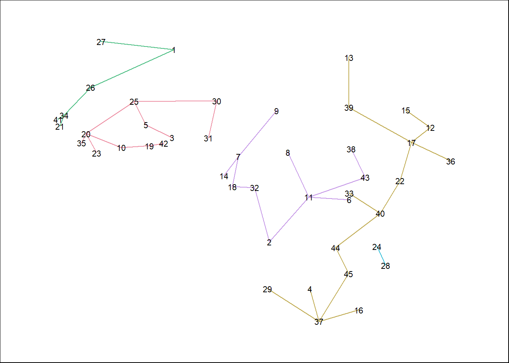

## Import Libraries


::: {.cell}

```{.r .cell-code}
library(dplyr)
library(spdep)
library(fields)
library(sf)
library(ggplot2)
library(maps)
library(httr)
library(jsonlite)
library(here)
```
:::


## Import Data


::: {.cell}

```{.r .cell-code}
## Import data and extract the malaria information for just Africa

malaria_by_country <- read.csv('../../data/malaria_by_country.csv')

malaria_by_country<- malaria_by_country[malaria_by_country$IND_CODE=='MALARIA_EST_INCIDENCE',]

malaria_by_country <- malaria_by_country[,c(1,2,7)]


## Editing some names to match values with spData::world
malaria_by_country$DIM_GEO_NAME[27] <- "Côte d'Ivoire"
malaria_by_country$DIM_GEO_NAME[38] <-'eSwatini'
malaria_by_country$DIM_GEO_NAME[106] <-'Tanzania'
malaria_by_country$DIM_GEO_NAME[42] <-'The Gambia'
malaria_by_country$DIM_GEO_NAME[25] <-'Republic of the Congo'
```
:::


Importing map data


::: {.cell}

```{.r .cell-code}
africa_map_data <- spData::world[spData::world$continent == 'Africa',]
```
:::


Merging map data along with malaria data


::: {.cell}

```{.r .cell-code}
malaria_by_country <- merge(malaria_by_country,africa_map_data, by.x = 'DIM_GEO_NAME', by.y = 'name_long')

malaria_by_country <- st_as_sf(malaria_by_country)
```
:::


## Plotting data coutns by location


::: {.cell}

```{.r .cell-code}
ggplot(malaria_by_country)+
  geom_sf(aes(fill=VALUE_NUMERIC))
```

::: {.cell-output-display}
{width=672}
:::
:::


## Spatial Clustering using MST

Removing Madagascar due to it being completely disconnected


::: {.cell}

```{.r .cell-code}
malaria_by_country <- malaria_by_country[malaria_by_country$DIM_GEO_NAME != 'Madagascar',]
```
:::


Calculating adjacency nb object, and centroids


::: {.cell}

```{.r .cell-code}
bh.nb <- poly2nb(malaria_by_country)
s <- st_centroid(malaria_by_country)$geom
```
:::


Calculating weighted matrix using nbcosts function


::: {.cell}

```{.r .cell-code}
dpad <- data.frame(scale(malaria_by_country$VALUE_NUMERIC))
lcosts <- nbcosts(bh.nb, dpad)
nb.w <- nb2listw(bh.nb, lcosts, style="B")
mst.bh <- mstree(nb.w,5)
```
:::


Mstree plot


::: {.cell}

```{.r .cell-code}
coords <- as.matrix(st_coordinates(s))

par(mar=c(0,0,0,0))
plot(st_geometry(malaria_by_country), border=gray(.5))
plot(mst.bh, coords, col=2, 
     cex.lab=.6, cex.circles=0.035, fg="blue", add=TRUE)
```

::: {.cell-output-display}
{width=672}
:::
:::


Clustering with MStree


::: {.cell}

```{.r .cell-code}
k=5 ## three clusters

res1 <- skater(mst.bh[,1:2], dpad, k-1) 
membership = res1$groups
### groups size
table(membership)
```

::: {.cell-output .cell-output-stdout}

```
membership
 1  2  3  4  5 
11 15  6  2 11 
```


:::
:::


Plotting mstrees with cut points


::: {.cell}

```{.r .cell-code}
opar <- par(mar=c(0,0,0,0))
plot(res1, coords, cex.circles=0.035, cex.lab=.7) 
```

::: {.cell-output-display}
{width=672}
:::
:::


Coloring clusters on map


::: {.cell}

```{.r .cell-code}
plot(st_geometry(malaria_by_country), col=heat.colors(length(res1$edg))[res1$groups])
```

::: {.cell-output-display}
{width=672}
:::

```{.r .cell-code}
ggplot(cbind(malaria_by_country,res1$groups), aes(fill=as.factor(res1.groups)))+
  geom_sf() + scale_fill_manual(values = c('red','orange','yellow','darkred','lightyellow'))
```

::: {.cell-output-display}
{width=672}
:::
:::